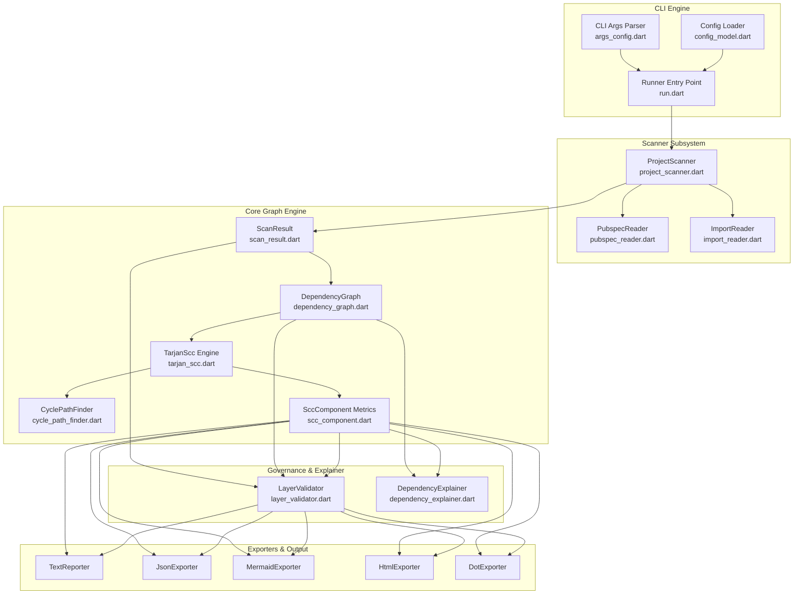
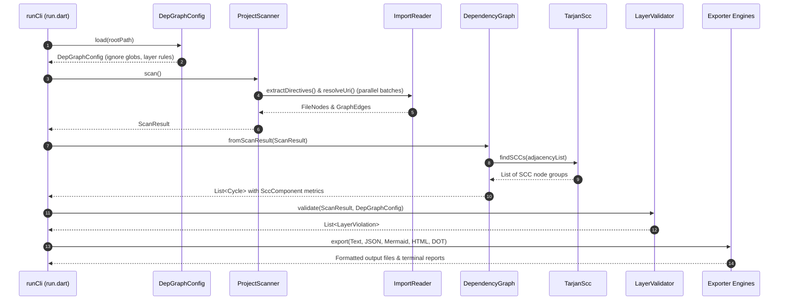

# `dep_graph_visualizer` — Architecture & Technical Design Specification

This document provides a comprehensive technical overview of the system architecture, component design, data flow, algorithmic implementations, and scalability mechanics of `dep_graph_visualizer`.

---

## 1. System Overview & Architecture Goals

`dep_graph_visualizer` is a high-performance Dart library and CLI tool engineered for static architecture analysis, circular dependency detection, and architectural boundary governance in Dart/Flutter monorepos and single-package projects.

### Key Architectural Objectives:
1. **High-Throughput Static Scanning**: Parse import/export directives rapidly across 1,000+ Dart files without relying on heavy, slow analyzer AST trees.
2. **Mathematically Accurate Cycle Analysis**: Utilize Tarjan's Strongly Connected Component (SCC) algorithm to identify complete dependency clusters rather than isolated loops.
3. **Architectural Governance**: Enforce Clean Architecture layer rules and directional boundary constraints configured via `dep_graph.yaml` or `pubspec.yaml`.
4. **Scalable Multi-Format Visualization**: Render interactive HTML visualizers, Mermaid.js diagrams, JSON payloads, and Graphviz DOT graphs with scope filtering to eliminate browser freezes on massive codebases.

---

## 2. High-Level Architecture

The system is designed with strict separation of concerns, decoupling static file scanning, graph construction, cycle detection, rule validation, and multi-format exporting.

---

## 3. Subsystem Breakdown

### 3.1 Scanner Subsystem (`lib/src/scanner/`)
- **`ProjectScanner`**: Coordinates project scanning. Employs bounded parallel file reading via `Future.wait` (in chunks of 64 files) to maximize disk I/O throughput.
- **`ImportReader`**: Lightweight regex directive extractor that identifies `import`, `export`, and conditional quoted URIs (`if (dart.library.html) ...`) without building full AST trees. Resolves relative paths, `package:` URIs, and cross-package workspace dependencies.
- **`PubspecReader`**: Discovers Dart 3.6+ workspace packages (`workspace: [...]`) and Melos repositories (`packages/*`, `apps/*`), mapping member package names to lib paths.

### 3.2 Graph & Cycle Engine (`lib/src/graph/` & `lib/src/models/`)
- **`ScanResult`**: Read-only snapshot of scanned file nodes and directed graph edges.
- **`DependencyGraph`**: Constructs incoming and outgoing adjacency edge maps from `ScanResult`.
- **`TarjanScc`**: Implements Tarjan's non-recursive algorithm to partition graph nodes into Strongly Connected Components (SCCs) in $O(V + E)$ linear time.
- **`CyclePathFinder`**: Finds shortest representative cycle paths within multi-node SCCs using breadth-first traversal.
- **`SccComponent`**: Calculates architectural severity metrics for each SCC group:
  - **Internal Edges Count**: Total edges connecting files inside the component.
  - **Average Fan-In / Fan-Out**: Average incoming and outgoing dependencies.
  - **Instability Metric ($I$)**: $I = \frac{\text{Fan-Out}}{\text{Fan-In} + \text{Fan-Out}}$ (0.0 = stable, 1.0 = unstable).
  - **Architectural Density ($D$)**: $D = \frac{\text{InternalEdges}}{N(N - 1)}$ for $N > 1$.
  - **Hub File Identification**: File node with highest combined degree ($in + out$) in the SCC.

### 3.3 Governance & Checker Subsystem (`lib/src/checker/` & `lib/src/models/config_model.dart`)
- **`DepGraphConfig`**: Loads project configuration from `dep_graph.yaml` or `pubspec.yaml -> dep_graph_visualizer:`.
- **`LayerValidator`**: Compiles layer glob patterns (e.g. `lib/domain/**`) and validates dependency edges against declared `allowed_imports`. Detects directional violations (e.g., Domain layer importing Presentation or Data layers).

### 3.4 Inspection & Explainer Subsystem (`lib/src/graph/dependency_explainer.dart`)
- **`DependencyExplainer`**: Provides targeted file analysis via CLI `--explain <file>`. Resolves exact target files, reports SCC membership, metrics, representative cycle paths, and direct incoming/outgoing dependency lists.

### 3.5 Exporters & Reporters Subsystem (`lib/src/exporters/` & `lib/src/reporters/`)
- **`TextReporter`**: Formats ANSI-colored or plain text terminal output displaying scan stats, SCC metrics, hub files, cycle chains, and layer boundary violations.
- **`JsonExporter`**: Produces machine-readable JSON structure for CI/CD pipelines and external dashboards.
- **`MermaidExporter`**: Exports Mermaid.js markdown flowchart syntax (`.mmd`) with highlighted cyclic nodes.
- **`HtmlExporter`**: Generates single-file interactive HTML graph visualizers using `vis-network`. Implements physics stabilization freeze and `--scope cycles` graph trimming.
- **`DotExporter`**: Exports Graphviz DOT files (`.dot`) with clustered subgraphs for each SCC.

---

## 4. Execution Trajectory & Data Flow

---

## 5. Algorithmic Deep Dive

### 5.1 Tarjan's Strongly Connected Components (SCC)
Tarjan's algorithm partitions a directed graph $G = (V, E)$ into maximal strongly connected subgraphs where every vertex in an SCC is reachable from any other vertex in the same SCC.

- **Time Complexity**: $O(|V| + |E|)$ linear time.
- **Space Complexity**: $O(|V|)$ auxiliary stack depth.

### 5.2 Architectural Severity Calculations
Given an SCC component containing node set $V_{scc} \subseteq V$ with size $N = |V_{scc}|$:

1. **Internal Edges**:
   $$E_{int} = |\{(u, v) \in E \mid u \in V_{scc} \land v \in V_{scc}\}|$$

2. **Instability Metric ($I$)**:
   $$I = \frac{\text{Fan-Out}}{\text{Fan-In} + \text{Fan-Out}}$$

3. **Coupling Density ($D$)**:
   $$D = \frac{E_{int}}{N(N - 1)} \quad \text{for } N > 1$$

4. **Hub Node Selection**:
   $$\text{Hub} = \arg\max_{v \in V_{scc}} \left( \text{in\_degree}(v) + \text{out\_degree}(v) \right)$$

---

## 6. Performance & Scalability Design Choices

1. **Bounded Parallel File I/O**:
   Sequential file reads accumulate latency on large repositories. `ProjectScanner` processes Dart files using a bounded concurrency worker queue (`Future.wait` in chunks of 64), maximizing SSD read throughput while preventing file descriptor exhaustion.

2. **Scope-Based Graph Trimming (`--scope cycles`)**:
   In enterprise monorepos with 5,000+ files, 95%+ of files are acyclic leaf nodes. Exporting the entire un-filtered graph causes $O(N^2)$ force-directed physics calculations in Vis-network and crashes browser rendering tabs.
   Setting `--scope cycles` (default) trims the export canvas to **only SCC cyclic nodes plus 1-hop boundary context**, reducing node count from 5,000 to ~30 nodes.

3. **Physics Stabilization Freezing**:
   In the HTML visualizer, physics simulation is allowed to stabilize for 100 iterations on paint, after which physics calculation is explicitly frozen (`network.setOptions({ physics: false })`). This eliminates background CPU spin and maintains 60fps browser interactions.

---

## 7. Extensibility & Future Evolution

The modular design allows straightforward future extensions:
- **SARIF Exporter**: Adding a `SarifExporter` to output SARIF format for native GitHub Code Scanning annotations on PR diff lines.
- **Minimum Cut Refactoring Heuristic**: Computing minimum edge cuts in SCC subgraphs to recommend exact imports to break or abstract with minimum code refactoring effort.
- **IDE Extensions**: Exposing the Dart programmatic API (`DependencyGraph`, `DependencyExplainer`) to VS Code and IntelliJ plugins for real-time inline cycle warnings.
