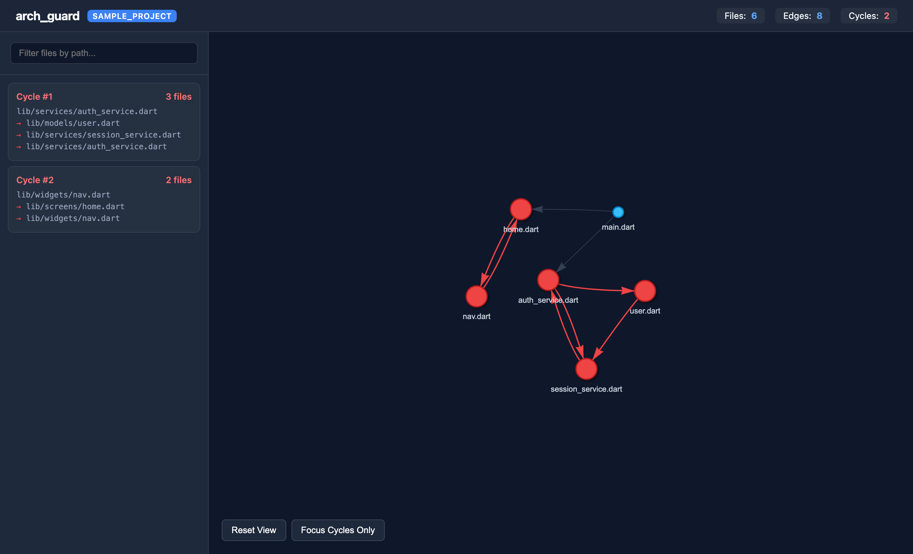
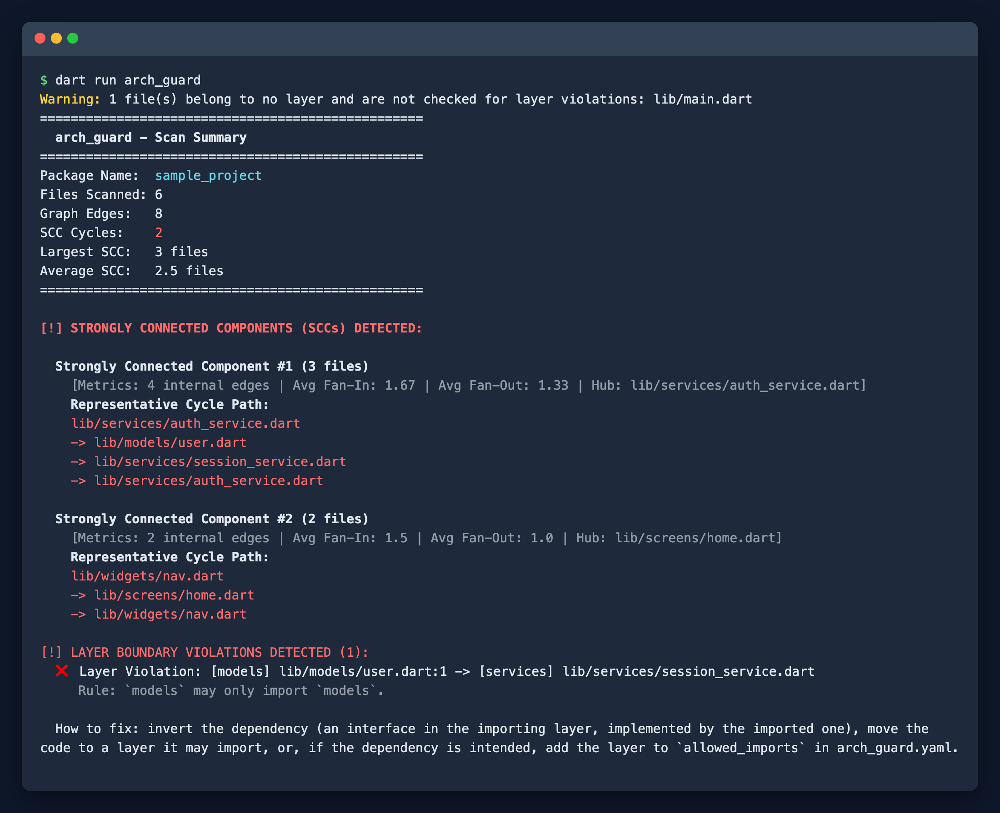

[Home](index.md) · [Presets](presets.md) · [Configuration](configuration.md) · [CI & hooks](ci.md) · [CLI](cli.md) · [Dart API](api.md)

# arch_guard

arch_guard keeps the architecture of a Dart or Flutter project the way you meant it. It reads every `import`, `export` and `part` directive and then:

- fails when a file imports a layer it should not (for example `presentation` importing `data`),
- finds groups of files that import each other in a circle,
- draws the dependency graph as interactive HTML, Mermaid or Graphviz.

It runs in the terminal, as a pre-commit hook, and in CI, where it can comment on pull requests and report to GitHub Code Scanning.



## Quickstart

```bash
dart pub add --dev arch_guard
dart run arch_guard init     # detects your layout and writes arch_guard.yaml
dart run arch_guard          # checks the project
```

`init` recognises Clean Architecture, Riverpod, Bloc and feature-first layouts. On an existing codebase, record today's problems with `dart run arch_guard --update-baseline` so that only new problems fail from then on.



## Where next

| If you want to… | Read |
| :--- | :--- |
| Pick and adjust rules for your architecture | [Presets](presets.md) |
| Write layers by hand, ignore files, use workspaces | [Configuration](configuration.md) |
| Run it on pull requests or before commits | [CI & hooks](ci.md) |
| See every flag, output format and exit code | [CLI](cli.md) |
| Build your own tooling on top | [Dart API](api.md) |

Found a bug or missing a preset? [Open an issue](https://github.com/creatorpiyush/arch_guard/issues).
